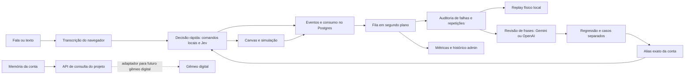

# Ativar e acompanhar os agentes do Norte

Site: <https://norte-r007.onrender.com>. No admin, abra **Agentes e métricas** (`#agentes`). As contas de teste continuam entrando em **Simulação de vigas**.

## 1. O que já funciona sem contratar outro serviço

- As abas **Canvas, Simulação, Gráficos, Resultados e Cálculos** aparecem desde o início. Também há um botão **Abrir simulação**.
- Pedidos como “quero abrir a simulação”, “quero fazer uma simulação”, “abirr simulação”, “vamos simular uma viga” e “simula a viga” funcionam sem dizer “Norte”. Abrir uma vista é uma operação local, sem chamada paga.
- Alterações como “muda a força P1 para 12 kN”, “reduz a viga em 10%” e “aumenta a viga em 1 metro” passam por interpretação, limites físicos e validação Jev. Negação, hipótese e citação continuam protegidas.
- O servidor registra resultados e consumo; uma fila persistente analisa falhas em segundo plano. Se o servidor reiniciar, trabalhos pendentes podem continuar.
- O replay de alterações físicas usa o parser e o motor de cálculo reais, sobre uma cópia da configuração. Nunca modifica a reunião em andamento.
- A API de memória consulta reuniões da própria conta. O adaptador pode ser substituído pelo gêmeo digital quando ele existir.

## 2. Qual chave usar agora

O teste realizado em **09/10/2026** com a chave Gemini local encontrou HTTP **404** no `gemini-2.5-flash` e **403 PERMISSION_DENIED** no `gemini-3.1-flash-lite`: “Your project has been denied access. Please contact support.” A lista de modelos respondeu, mas a geração não. Isso não comprova falta de créditos: o projeto/chave precisa recuperar acesso. As variáveis do Render podem conter outra chave, então confira o diagnóstico do provedor no painel.

Você pode corrigir esse projeto Google ou selecionar a alternativa OpenAI implementada para os agentes. A escolha é explícita: o sistema não muda de fornecedor por conta própria.

### Opção OpenAI

1. Entre em <https://platform.openai.com>.
2. Abra **Billing**: <https://platform.openai.com/settings/organization/billing/overview>. Cadastre o meio de pagamento e adicione o saldo disponível na sua conta.
3. Abra **API keys**: <https://platform.openai.com/api-keys>.
4. Crie uma chave para o projeto que usará o Norte e copie o valor.
5. No <https://dashboard.render.com>, abra o serviço que atende `norte-r007.onrender.com` → **Environment** → **Edit**.
6. Adicione ou altere exatamente:

```dotenv
AI_AGENTS_ENABLED=true
AI_EXTERNAL_REVIEW_ENABLED=true
AI_AGENT_PROVIDER=openai
OPENAI_API_KEY=COLE_A_CHAVE_AQUI
AI_OPENAI_MODEL=gpt-4.1-mini
AI_OPENAI_INPUT_USD_PER_MILLION=0.40
AI_OPENAI_OUTPUT_USD_PER_MILLION=1.60
AI_DAILY_BUDGET_USD=1.00
AI_DAILY_CALL_LIMIT=50
AI_AUTO_PUBLISH=true
AI_RETENTION_DAYS=90
JEV_INPUT_USD_PER_MILLION=0.042
JEV_OUTPUT_USD_PER_MILLION=0
```

7. Clique **Save, rebuild, and deploy** e aguarde o serviço ficar **Live**.
8. Entre como admin → **Agentes e métricas** → confira o provedor, a configuração e eventuais erros. “Chave configurada” informa presença da chave; uma chamada bem-sucedida é o que confirma o acesso.

Coloque a chave diretamente no Render. Localmente, coloque no `.env`, que é ignorado pelo Git. Nunca cole a chave no frontend, em um commit ou em um exemplo público.

O modelo usado nessa opção aceita saída estruturada e custa, na consulta de 09/10/2026, **US$ 0,40 por milhão de tokens de entrada e US$ 1,60 de saída**. O envio usa Responses API com `store: false`, sem ferramentas externas. [Modelo e tarifas oficiais](https://developers.openai.com/api/docs/models/gpt-4.1-mini), [saída estruturada](https://developers.openai.com/api/docs/guides/structured-outputs).

### Opção Gemini

1. Abra <https://aistudio.google.com/apikey> e crie uma chave em um projeto com acesso à Gemini API.
2. Para habilitar cobrança, abra **Set up billing** no projeto no AI Studio. Se a conta usar pré-pagamento, adicione créditos em <https://aistudio.google.com/billing>. A documentação consultada informa compra mínima de US$ 5; siga o valor exibido para sua conta. [Cobrança Gemini](https://ai.google.dev/gemini-api/docs/billing).
3. No Render → serviço → **Environment**, configure:

```dotenv
GOOGLE_API_KEY=COLE_A_CHAVE_GOOGLE_AQUI
AI_AGENT_PROVIDER=gemini
AI_EXTERNAL_REVIEW_ENABLED=true
AI_AGENT_MODEL=gemini-2.5-flash
AI_GEMINI_INPUT_USD_PER_MILLION=0.30
AI_GEMINI_OUTPUT_USD_PER_MILLION=2.50
```

4. Mantenha os limites diários do bloco anterior e publique a alteração.
5. Se continuar aparecendo 403, resolva o acesso do projeto com o Google; comprar saldo não garante corrigir esse erro. Se o modelo retornar 404, confira os modelos disponíveis e atualize **modelo e tarifas juntos**.

As tarifas acima correspondem ao Gemini 2.5 Flash para texto, incluindo tokens de raciocínio na saída. [Tabela oficial Gemini](https://ai.google.dev/gemini-api/docs/pricing).

**A ata mantém sua integração Gemini própria**, configurada por `GOOGLE_API_KEY` e `GEMINI_MODEL`. Escolher OpenAI para os agentes não migra a geração da ata. A ata local/exportação existente continua disponível; a organização da ata por Gemini depende de recuperar essa API.

### Jev

Mantenha `TYPESAFE_API_KEY` configurada. Para obter uma nova chave, entre em <https://console.typesafe.ai> → dashboard → chaves de API. Cobrança e saldo são gerenciados na mesma conta. A documentação consultada informa **US$ 0,042 por milhão de tokens de entrada, saída gratuita** para Jev 1.13; confira seu contrato se usar outra tarifa. [Primeiros passos](https://docs.typesafe.ai/introduction/quickstart), [modelos e preços](https://docs.typesafe.ai/models).

## 3. Preciso pagar mais no Render?

Para testes ocasionais, o plano gratuito executa a aplicação e a fila enquanto o serviço está acordado. **Para os agentes continuarem trabalhando sem depender de alguém abrir o site, use um serviço pago sempre ativo.** A fila fica no Postgres; não exige Redis nem uma segunda máquina nesta implantação inicial.

No Render, abra o serviço → **Compute** → **Edit** → escolha **0.5c-512mb**, anteriormente chamado **Starter**. Faça o mesmo com o banco, escolhendo um Postgres pago adequado, inicialmente **0.1c-256mb**, anteriormente **Basic-256mb**. Confira o preço exibido antes de confirmar. Como referência, o Render publicou cerca de **US$ 13/mês** para essa combinação, antes de crescimento de armazenamento/tráfego. [Planos de computação](https://render.com/docs/compute-plans), [referência de custos](https://render.com/articles/how-much-does-cloud-application-hosting-cost-for-small-businesses).

O serviço gratuito dorme após 15 minutos sem tráfego, e o Postgres gratuito expira após 30 dias. Não armazene a única cópia das reuniões em SQLite no Render: o filesystem é efêmero. Mantenha `DATABASE_URL` ligada ao Postgres. [Limites gratuitos](https://render.com/docs/free).

O `render.yaml` conserva o plano gratuito: **esta entrega não compra nem troca seu plano**. Ele inclui as novas variáveis para instalações/sincronizações por Blueprint. Em um serviço já existente, confira **Environment**; publicar o código não garante importar novas variáveis do YAML.

O replay físico requer Node.js, disponível nos runtimes nativos do Render. Se faltar em outro ambiente, o histórico informa a indisponibilidade; o processamento da reunião continua. [Ferramentas dos runtimes](https://render.com/docs/native-runtimes).

## 4. Como as três camadas trabalham



O Jev classifica texto; a transcrição do áudio continua sendo feita pelo navegador. Os agentes não são três serviços pagos independentes: são tarefas com funções diferentes, coordenadas pelo mesmo backend.

**Auditoria:** procura pedidos não reconhecidos, repetições, recuperação após outro pedido/click e avaliações negativas. **Validação:** reproduz operações localmente e testa candidatos de navegação contra regressões e casos separados. **Métricas:** consolida execução, avaliações, latência e uso dos provedores. A revisão semântica só envia uma frase candidata e sua contagem de recuperações; nunca envia o estado físico, memória completa, conta ou reunião inteira.

## 5. O que aprende sozinho, e o limite atual

Se uma frase de abertura falhar repetidamente e depois houver uma abertura bem-sucedida, o auditor registra a recuperação. Evidências em **duas sessões independentes**, confirmação semântica (ou rótulos humanos suficientes) e testes aprovados permitem ativar um **alias exato de abertura para aquela conta**. O admin pode desativá-lo no histórico. `AI_AUTO_PUBLISH=false` mantém as propostas sem ativação automática.

Isso aprende regras de interpretação da aplicação; **não retreina os pesos do Jev/Gemini/OpenAI**. Uma conta não publica regras nas outras. Falhas de parâmetros físicos são reproduzidas e diagnosticadas, mas não geram alterações de código, fórmulas ou prompts em produção. O sistema não inventa números ausentes. Correções que exigirem mudar o software continuam exigindo desenvolvimento. Essa fronteira evita que uma avaliação errada degrade os cálculos.

O ganho prático imediato está na linguagem natural ampliada, funções visíveis, respostas locais rápidas, recuperação de frases e reprodução automática de falhas. Não existe garantia de compreender todas as falas possíveis nem de eliminar toda intervenção futura.

## 6. Ler o dashboard sem confundir as métricas

| Indicador | O que mede |
| --- | --- |
| Acerto validado | Avaliações explícitas de usuários. Sem avaliações, mostra “—”. |
| Execução operacional | Pedidos/eventos processados com sucesso técnico. Não comprova que a intenção foi entendida. |
| Latência p50 / p95 | Distribuição do tempo observado nos eventos retidos; não é só velocidade do modelo. |
| Propostas publicadas | Proporção de propostas que passaram pelos critérios de ativação. Não é melhoria percentual de acurácia. |
| Replay | Resultado de casos de teste do adaptador indicado. Não representa acerto geral em conversas reais. |
| Tokens | Uso informado pelos provedores. Ausência de informação não é estimada como token zero de uma chamada conhecida. |
| Custo estimado | Tokens medidos × tarifas configuradas. Chamadas com preço desconhecido ficam destacadas e fora da soma. |

Os custos exibidos não incluem Render, impostos, câmbio ou serviços externos de transcrição. O orçamento diário limita **revisão semântica dos agentes/resolver**, compartilhado pelas contas; não limita o Jev das reuniões nem a geração de atas. O dia de orçamento usa UTC. Uma tentativa sem resposta conserva a reserva de custo para não tratar uma chamada possivelmente cobrada como gratuita.

Em **Arquitetura atual**, clique nos blocos para ver as perguntas e opções do Jev carregadas dos mesmos arquivos que a aplicação usa. O flow anterior permanece disponível. Em **Testar interpretações**, execute a bateria local ou forneça casos com resultado esperado. **Exportar PDF** abre a impressão: escolha **Salvar como PDF**.

## 7. Conferência depois do deploy

1. Abra o site em janela anônima e crie uma conta comum.
2. Crie uma reunião: confira as cinco abas e o botão **Abrir simulação**.
3. Abra a simulação por click. Explore gráficos, resultados e cálculos sem iniciar o microfone.
4. Inicie a reunião e diga ou escreva “quero fazer uma simulação”. Experimente “muda a força P1 para 12 kN” e “reduz a viga em 10%”.
5. Confira a mudança na vista/valor e use **Entendeu / Não era isso** quando quiser fornecer uma avaliação.
6. Entre no admin → **Agentes e métricas** → **Atualizar**. Confira eventos, consumo, jobs e diagnósticos. O painel começa sem acurácia validada: isso é esperado.
7. Clique em **Testar interpretações** e rode o replay. Confira seu escopo antes de usar o resultado em uma apresentação.

Se o deploy não atualizar: serviço Render → **Manual Deploy** → **Deploy latest commit**. O branch é `main` do repositório <https://github.com/Raiagues/piloto>.

## 8. API preparada para a memória do projeto

`POST /api/ai/memory/query` recebe `{"query":"resultado da viga","session_id":"opcional"}` com a sessão autenticada. A resposta traz trechos, IDs de evento/reunião, origem e limites de consulta. A busca atual é lexical, restrita às 30 reuniões recentes dentro do limite de tamanho, sem inventar um gêmeo digital conectado. `ProjectMemory` em `ai_runtime.py` é o ponto de substituição por uma fonte futura.

Histórico/telemetria usam SQLite local ou o mesmo Postgres das contas. A retenção padrão é 90 dias para eventos, uso e avaliações. Regras publicadas continuam versionadas. Nenhuma chave é enviada ao navegador.
